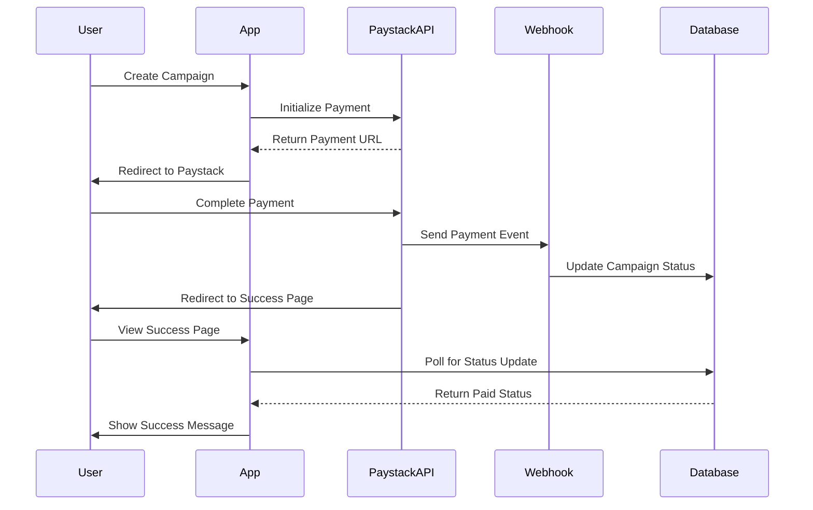

# Campaign Payment Flow - Testing Guide

## Overview
This guide will help you test the complete campaign payment integration with Paystack.

## Prerequisites
- Paystack test account credentials configured
- PAYSTACK_SECRET_KEY set in Lovable Cloud secrets
- Access to admin dashboard (admin tier user)

## Payment Flow Architecture



## Testing Steps

### Step 1: Create a Campaign (User Flow)
1. **Navigate to Promotions Page**
   - Go to `/app/promotions`
   - Browse available promotion bundles or services

2. **Select Services**
   - Choose a promotion bundle (e.g., "Starter Package")
   - OR select individual services
   - Click "Create Campaign"

3. **Fill Campaign Details**
   - **Campaign Name**: "Test Campaign [timestamp]"
   - **Artist**: Select or create artist
   - **Campaign Type**: Choose platform (Instagram/TikTok/etc.)
   - **Start Date**: Today or future date
   - **Target Audience**: Optional demographic details
   - **Campaign Assets**: Optional images/videos
   - **Social Links**: Optional social media URLs

4. **Submit & Proceed to Payment**
   - Review campaign summary
   - Click "Create Campaign & Proceed to Payment"
   - Campaign status: **Draft** → **Pending Payment**

### Step 2: Process Payment (Paystack)
You'll be redirected to Paystack's payment page.

#### Test Card Details (Paystack Test Mode)
```
Card Number: 4084 0840 8408 4081
CVV: 123
Expiry: Any future date
PIN: 0000 (if requested)
OTP: 123456 (if requested)
```

**Payment Actions:**
- ✅ **Successful Payment**: Use the test card above
- ❌ **Failed Payment**: Use card `5060 6666 6666 6666 666`
- ⏸️ **Abandoned Payment**: Close the payment page

### Step 3: Verify Payment (Success Page)
After successful payment:

1. **Automatic Redirect**
   - You'll be redirected to `/app/campaign-payment-success?reference=[payment_ref]`
   - See "Verifying Payment..." status with loading spinner

2. **Payment Verification**
   - System polls database every 3 seconds (max 60 seconds)
   - Webhook processes payment in background
   - Database updates campaign status: **Pending Payment** → **Paid**

3. **Success Confirmation**
   - Green checkmark appears
   - Message: "Payment Successful! Your campaign is now under review."
   - Options to view campaigns or create another

### Step 4: Admin Monitoring
As an admin user, monitor the payment:

1. **Access Admin Payments Dashboard**
   - Navigate to `/admin/payments`
   - View the "Payments" section in admin sidebar

2. **View Payment Statistics**
   - **Total Paid**: Sum of all successful payments
   - **Pending Payment**: Sum of awaiting payments
   - **Failed Payments**: Sum of unsuccessful attempts
   - Campaign counts for each status

3. **Check Payment Details Table**
   - Find your test campaign in the table
   - Verify payment details:
     - Date/Time of payment
     - Campaign name
     - User information
     - Payment amount
     - Payment status badge (Paid/Pending/Failed)
     - Payment reference (Paystack transaction ID)
     - Campaign status

4. **Test Export Functionality**
   - Click "Export CSV" button
   - Verify CSV contains all payment data
   - Check file naming: `campaign-payments-[date].csv`

5. **Test Search & Filters**
   - Search by campaign name
   - Search by payment reference
   - Filter by payment status (Pending/Paid/Failed/Refunded)
   - Verify results update correctly

## Expected Database Changes

### Campaign Record Updates
```sql
-- After payment initialization
status: 'Pending Payment'
payment_status: 'pending'
payment_reference: 'paystack_ref_123456'
payment_amount: 50000

-- After successful payment (webhook)
status: 'Paid'
payment_status: 'paid'
payment_reference: 'paystack_ref_123456' (unchanged)
```

### Check Database Manually (Optional)
```sql
-- View campaign payment details
SELECT 
  id,
  name,
  status,
  payment_status,
  payment_amount,
  payment_reference,
  created_at,
  updated_at
FROM campaigns
WHERE payment_reference = '[your_reference]';
```

## Webhook Testing

### Verify Webhook Configuration
1. Check Paystack Dashboard
   - Go to Settings → Webhooks
   - Verify webhook URL: `https://[your-project].supabase.co/functions/v1/paystack-campaign-payment-webhook`
   - Ensure webhook is active

2. Test Webhook Endpoint
   - Webhook receives `charge.success` event
   - Verifies signature using PAYSTACK_SECRET_KEY
   - Updates campaign to "Paid" status
   - Sets payment_status to 'paid'

### Monitor Webhook Logs
Check edge function logs for webhook events:
```bash
# In Lovable Cloud backend
Check: supabase/functions/paystack-campaign-payment-webhook
Look for: 'Webhook event received', 'Processing campaign payment'
```

## Troubleshooting

### Payment Verification Times Out
**Symptoms**: "Payment verification timed out" message
**Possible Causes**:
- Webhook not configured in Paystack dashboard
- Webhook signature verification failing
- Network issues between Paystack and your backend

**Solutions**:
1. Check webhook configuration in Paystack
2. Verify PAYSTACK_SECRET_KEY matches Paystack dashboard
3. Check webhook logs for errors
4. Manually verify payment status in database

### Payment Status Not Updating
**Symptoms**: Campaign stays in "Pending Payment" status
**Solutions**:
1. Check webhook logs for errors
2. Verify payment was successful in Paystack dashboard
3. Check campaign record in database
4. Manually update status if needed:
```sql
UPDATE campaigns 
SET status = 'Paid', payment_status = 'paid'
WHERE id = '[campaign_id]';
```

### Failed Payment Handling
**Expected Behavior**:
- User sees error on Paystack page
- Redirected back with failed status
- Campaign remains in "Pending Payment" or "Draft"
- payment_status set to 'failed'
- User can retry payment

## Security Verification

### ✅ Security Checklist
- [ ] Webhook signature verified (SHA-512)
- [ ] No client-side Paystack verification
- [ ] Database polling used instead of client API calls
- [ ] Service role key used for webhook operations
- [ ] User authentication required for payment initialization
- [ ] Campaign ownership verified before payment
- [ ] Payment amounts calculated server-side

### ⚠️ Security Warnings to Ignore
If you see these in tests, they're expected:
- "Leaked password protection" - Not related to payment flow
- Dashboard access warnings - Only affects admin users

## Test Scenarios

### Scenario 1: Successful Payment Flow
1. Create campaign → 2. Pay successfully → 3. Verify on success page → 4. Check admin dashboard
**Expected**: All steps complete, campaign shows "Paid" status

### Scenario 2: Failed Payment
1. Create campaign → 2. Use failed test card → 3. See error → 4. Check admin dashboard
**Expected**: Campaign stays "Pending Payment", payment_status = 'failed'

### Scenario 3: Abandoned Payment
1. Create campaign → 2. Start payment → 3. Close payment page → 4. Check admin dashboard
**Expected**: Campaign stays "Pending Payment", no payment record

### Scenario 4: Multiple Campaigns
1. Create 3 campaigns → 2. Pay for all → 3. Check admin dashboard
**Expected**: All 3 appear in payments table, stats update correctly

## Performance Benchmarks

- **Payment Initialization**: < 2 seconds
- **Webhook Processing**: < 1 second
- **Status Update Detection**: 3-60 seconds (polling interval)
- **Admin Dashboard Load**: < 2 seconds
- **Export Generation**: < 1 second for 100 records

## Next Steps After Testing

Once payment flow is verified:
1. ✅ Switch Paystack to live mode (production keys)
2. ✅ Configure production webhook URL
3. ✅ Test with real small amounts
4. ✅ Monitor for 24-48 hours
5. ✅ Set up payment monitoring alerts
6. ✅ Document any edge cases discovered

## Support Resources

- **Paystack Documentation**: https://paystack.com/docs
- **Webhook Testing**: https://paystack.com/docs/payments/webhooks
- **Test Cards**: https://paystack.com/docs/payments/test-payments

## Summary

The payment integration is complete with:
- ✅ Secure payment initialization
- ✅ Webhook-based verification
- ✅ Database polling for status updates
- ✅ Admin monitoring dashboard
- ✅ Export functionality
- ✅ Comprehensive error handling

All components are production-ready and secure!
